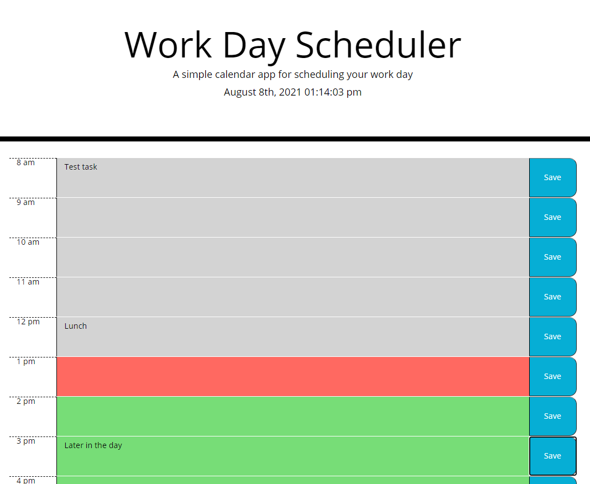

# daily-planner

Description
------------

Webpage that shows a calendar by hour for the current day. You can enter tasks in the text area and then save them down using the save buttons to the right of the textarea. This text will be saved in local storage and then will be called back upon when the page loads back up.

The site can be seen using the following URLs: 

* https://kjphelps90.github.io/daily-planner/

Author(s)
------------

* HTML, CSS - Rutgers University/Kevin Phelps

* Javascript  - Kevin Phelps

Version history
------------

0.1 - Inital Release

Preview
------------

